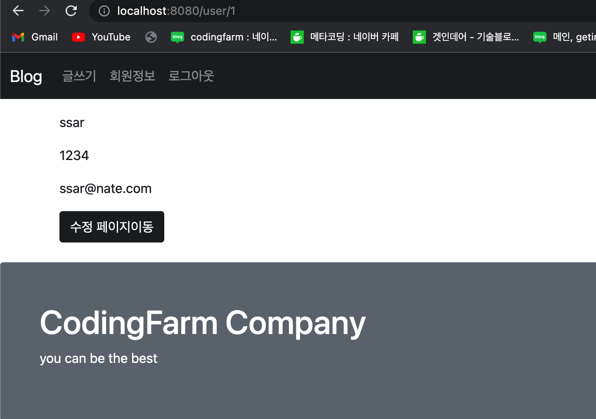
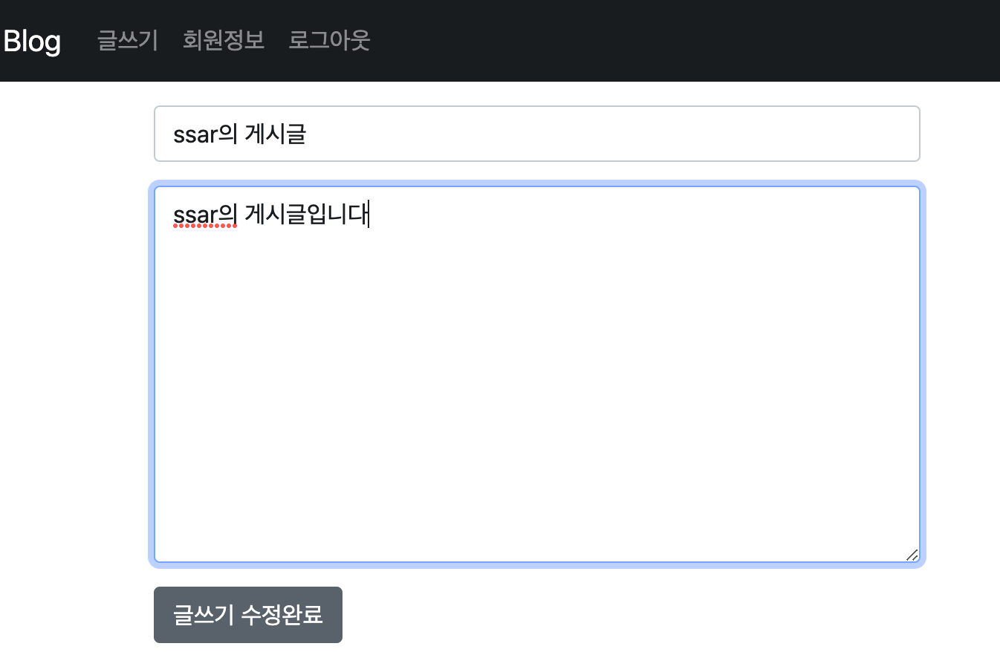
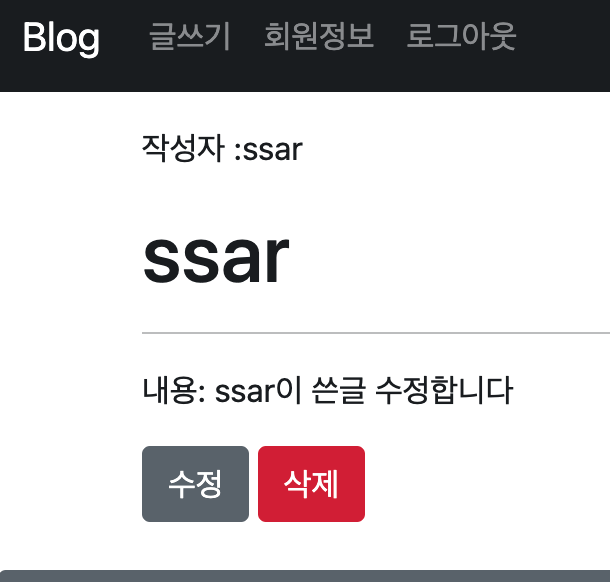

# 스프링부트 JPA 블로그 V2

### 1. 의존성
- devtools
- spring web (mvc)
- mustache
- lombok
- jpa
- mariadb

### 2. DB 설정
```sql
CREATE USER 'green'@'%' IDENTIFIED BY 'green1234';
CREATE DATABASE greendb;
GRANT ALL PRIVILEGES ON greendb.* TO 'green'@'%';
```
### 3. yml 설정
```yml
server:
  port: 8080
  servlet:
    context-path: /
    encoding:
      charset: utf-8

spring:
  mustache:
    expose-session-attributes: true
  datasource:
      url: jdbc:mariadb://localhost:3306/greendb
      driver-class-name: org.mariadb.jdbc.Driver
      username: green
      password: green1234

  jpa: 
    open-in-view: true
    hibernate:
      ddl-auto: update
      naming:
        physical-strategy: org.hibernate.boot.model.naming.PhysicalNamingStrategyStandardImpl
    show-sql: true
    properties:
      hibernate.format_sql: true
  output:
    ansi:
      enabled: always
```

### 기능정리
1. 엔티티 생성 완료 및 UI 작업중 
2. 유저 관련 UI 완성

**회원가입 화면**

**로그인 화면**

3. 회원가입 로그인 처리 완료


4. 회원 정보 보기 및 유효성 검사 

5. 로그아웃 처리

6. 회원 수정페이지 데이터 렌더링 

7. 쿠키를 이용한 유저네임 기억하기

8. 인증 필터링을 위한 주소 설계 변경

9. 글쓰기 페이지 완료


10. 글목록 페이지 완료

11. 글 상세보기 페이지 완료



12. LAZY & EAGER 전략 
13. 게시글 목록 DESC 정렬하기
14. 게시글 목록 PAGING 


15. 유저네임 중복검사 AJAX 사용
16. SERVICE LAYER를 사용한 TRANSACTION 관리
17. 회원정보 수정 - DIRTY CHECKING 사용
18. 게시글 삭제하기 


19. 게시글 상세보기 프론트 화면 권한 체크 


20. 게시글 수정하기




21. SUMMERNOTE 사용하기


22. SCRIPT 공격 방어하기 